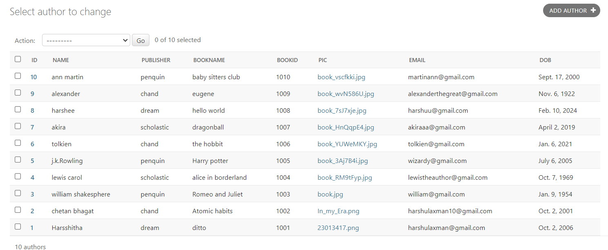

# Ex02 Django ORM Web Application
## Date: 29/02/2024

## AIM
To develop a Django application to store and retrieve data from a Book database using Object Relational Mapping(ORM).

## Entity Relationship Diagram


## DESIGN STEPS

### STEP 1:
Clone the problem from GitHub

### STEP 2:
Create a new app in Django project

### STEP 3:
Enter the code for admin.py and models.py
```
models.py 

from django.db import models
from django.contrib import admin
class Author(models.Model):
	id=models.IntegerField(primary_key=True);
	name=models.CharField(max_length=20);
	publisher=models.CharField(max_length=25);
	bookname=models.CharField(max_length=30);
	bookid=models.IntegerField();
	pic=models.FileField(help_text="Upload photo in 50 kb");
	email=models.EmailField();
	dob=models.DateField();
class AuthorAdmin(admin.ModelAdmin):
	list_display=("id","name","publisher","bookname","bookid","pic","email","dob");

admin.py

from django.contrib import admin
from .models import Author,AuthorAdmin
admin.site.register(Author,AuthorAdmin)
```


### STEP 4:
Execute Django admin and create details for 10 books

## PROGRAM
```
models.py 

from django.db import models
from django.contrib import admin
class Author(models.Model):
	id=models.IntegerField(primary_key=True);
	name=models.CharField(max_length=20);
	publisher=models.CharField(max_length=25);
	bookname=models.CharField(max_length=30);
	bookid=models.IntegerField();
	pic=models.FileField(help_text="Upload photo in 50 kb");
	email=models.EmailField();
	dob=models.DateField();
class AuthorAdmin(admin.ModelAdmin):
	list_display=("id","name","publisher","bookname","bookid","pic","email","dob");

admin.py

from django.contrib import admin
from .models import Author,AuthorAdmin
admin.site.register(Author,AuthorAdmin)
```

## OUTPUT



## RESULT
Thus the program for creating a database using ORM hass been executed successfully
